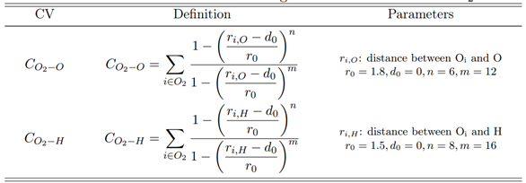
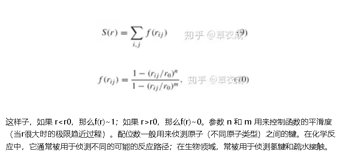
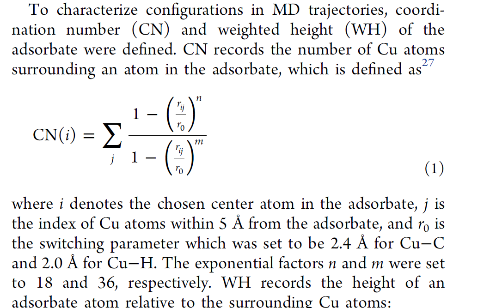
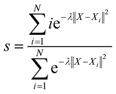
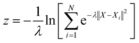

    

        ©️ <b><i>Copyright 2023 @ Authors</i></b> 
        <i>Author：
            <b>
            <a href="mailto:qhyu@stu.suda.edu.com">Trinity 📨 </a>
            </b>
        </i>
         
        <i>Date：2023-09-11</i> 
        <i>Need more help? </a>See more information in <a rel="license" href="https://github.com/Ternity/Trinity.github.io/">My GitHub Homepage </a>or send me email. Thanks!</i> 
    

## 23.9.4 for Prof. Wang Lu

### 进度

FF train：data collected

MD： normal（轨迹、控温控压、water RDF），MetaD（OH+H，H\_2\_O 脱附）

两篇类似的AIMD论文

### 问题

label中，电子结构计算，mag无法收敛到基态 <mark>答：看能量，能量太高的可以舍去（实际上结构太离谱）。对于磁矩，不必太关心。</mark>

电荷问题，DFT计算（数据集生成）搭建什么样的结构？结构中阴阳离子如何设置？是否考虑？<mark>答：直接加电子，不准确。不考虑恒电势，将离子视为原子计算。且不考虑电荷/离子/原子区别，没有定性的影响</mark>

如果用增强采样，就不能计算随机掺杂体系。<mark>答：不一定哦，虽然我们设置了数个CV，但是反应不一定同时发生，因此值得探索。</mark>

四电子各个过程的CV选取。<mark>答:根据最新的chem. sci.和杨满意的MetaD的CVs选取</mark>, <mark>根据刘远越老师的CV选取</mark>,<mark>**测试**</mark><mark>我们的CVs</mark>

<mark>其他:</mark>

<mark>1. 包装好工作,我们的优势:流程\更大的体系\全显式溶剂\随机掺杂模型等,核心是流程可推广至其他体系和反应</mark>

<mark>2\. 模型做好后,进行模型验证工作.对静态DFT,对角线图\\RMSE\\MAE等;对AIMD,RDF,自由能等;当然还有其他的方法,看文献学习.</mark>

## 23.9.6 for Dr. Li Pai

问题：

- MetaDynamic之CVs选取，参考文献
- OUTCAR中压力是哪个？

回答：

1. CV问题：

上述CV描述的是一种<mark>配位数（coordination numbers）</mark>

另有参考信息如下：

上述信息总结在：<a href="onenote:https://njfueducn-my.sharepoint.com/personal/180401224_njfu_edu_cn/Documents/笔记本/各种参考资料/使用方法/动力学前后处理.one#RDF、配位数及其在增强采样中应用&section-id={67F8EC12-B802-4F90-909A-4CD43C7FAAD6}&page-id={B384CDDA-764D-4417-951B-514C9C3D0FE2}&end">RDF、配位数及其在增强采样中应用</a>

另外，路径变量（path variables）也可能有用，请见Plumed的官网[CV部分](https://www.plumed.org/doc-v2.7/user-doc/html/_colvar.html)。

如下的这套集合，对CVs做了进一步计算，s 变量表示反应物和产物之间沿路径的进展，z表示与参考路径的距离，其具体含义有待进一步学习分析。请见[plumed官网介绍](https://www.plumed.org/doc-v2.7/user-doc/html/_a_d_a_p_t_i_v_e__p_a_t_h.html)和[Parrinello的论文](https://pubs.aip.org/aip/jcp/article/126/5/054103/187372/From-A-to-B-in-free-energy-space)。

<mark>答：实际上，这是一个由**配位数CV**组成个高级的**路径(path)CV**</mark>

path过程存在**数个**假象的中间体，X即中间体（的描述），而中间体又使用其他CV（如键、角、配位数等）来区分。这些中间体（CV）通过线性组合形成s(X).

s(X)是一条假象的反应路径，我们期望中间体X沿着s(X)进行。

z(X)是采样得到的中间体**偏离**s(X)定义的反应路径的距离

值得注意的是，这里选取了数个配位数（coordination numbers）作为中间体（CV），因为无法确定周围水中哪个水与反应物反应，因此使用了**配位数**定义的。

学习案例: [基于配位模式的路径集合变量在溶液中的化学反应](https://www.plumed-nest.org/eggs/19/032/)

尤其是，X选择什么样的结构？i的选取标准是什么?

2. 现在用的CV范围取小一点，不要太大。d~O-H-O~ ∈[-1.5, +1.5], d~Fe-O~∈[1.5, 3]
3. 比较关键结构在不同模型下的差别，关键结构指Fe-O-H 加上附近少数几个水在反应路径中的结构
即对比：不同关键结构下： iter-2 FF iter-3 FF DFT 的差别。
4. OUTCAR中压力，external pressure即维里，是势能对坐标的二阶导；kinetic pressure是指动能带来的压力；他们的和即总压。

